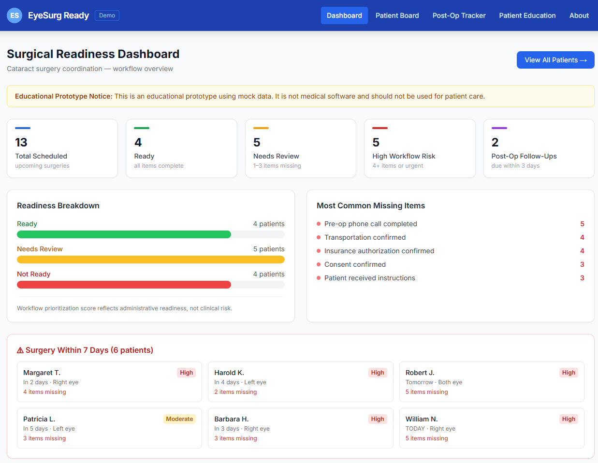
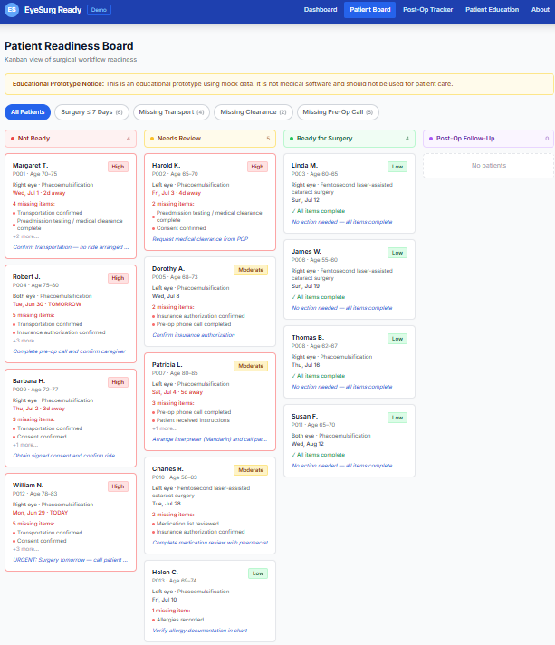
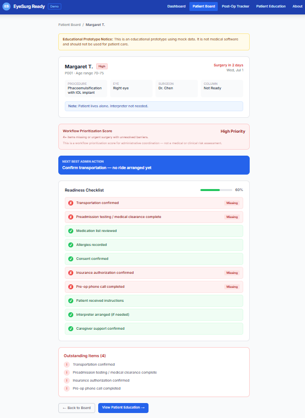
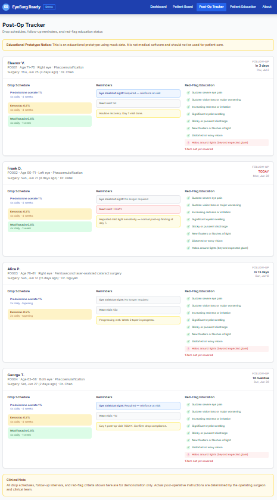
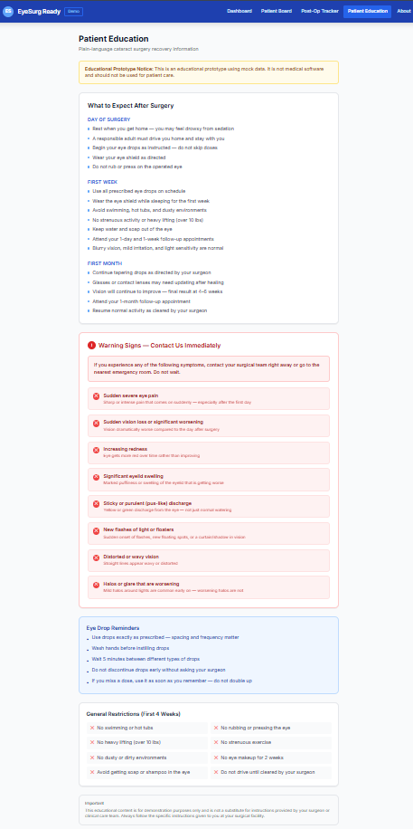
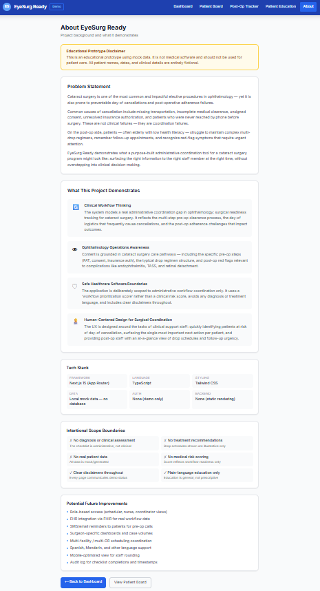

# EyeSurg Ready

**A mock ophthalmology surgical-readiness dashboard for cataract surgery coordination.**

> ⚠️ **Educational Prototype Notice:** This is an educational prototype using mock data. It is not medical software and should not be used for patient care. All patient names, dates, and clinical details are entirely fictional.

---

## Problem Statement

Cataract surgery is one of the most common elective procedures in ophthalmology — yet it is prone to preventable day-of cancellations and post-operative adherence failures. Common causes include missing transportation, incomplete medical clearance, unsigned consent, unresolved insurance authorization, and patients never reached by pre-op phone call. These are **coordination failures**, not clinical failures.

On the post-op side, patients — often elderly — struggle to maintain complex drop regimens, remember follow-up appointments, and recognize warning signs that need urgent attention.

EyeSurg Ready demonstrates what a purpose-built administrative coordination dashboard might look like: surfacing the right information to the right staff member at the right time, without overstepping into clinical decision-making.

---

## Features

### Dashboard
- Summary cards: total scheduled surgeries, ready, needs review, high workflow risk, post-op follow-ups due
- Readiness breakdown bar chart
- Most common missing item tracking
- Urgent patients panel (surgery ≤ 7 days)

### Patient Readiness Board (Kanban)
- Four columns: Not Ready · Needs Review · Ready for Surgery · Post-Op Follow-Up
- Patient cards with fake name, surgery eye, procedure, surgery date, missing items, and workflow risk level
- Filters: all · surgery ≤ 7 days · missing transportation · missing clearance · missing pre-op call
- Cards sorted by workflow priority within each column

### Patient Detail Page
- Mock demographics: name, age range, procedure, eye, surgery date, surgeon
- 10-item readiness checklist with visual completion progress
- Workflow prioritization score (Low / Moderate / High)
- Next best admin action field
- Outstanding items summary

### Post-Op Tracker
- Post-op patient cards with surgery date and days elapsed
- Drop schedule display (name, frequency, duration)
- Follow-up appointment date with urgency indicator
- Eye shield reminder status
- Red-flag education checklist (which topics have been covered)

### Patient Education Page
- Plain-language recovery timeline: Day of surgery · First week · First month
- Red flags section with contact-us-immediately emphasis
- Eye drop reminder guidance
- General restrictions list

### About Page
- Problem statement
- What this project demonstrates
- Intentional scope boundaries
- Tech stack
- Future improvement roadmap

---

## Screenshots

| Dashboard | Patient Board | Patient Detail |
|-----------|---------------|----------------|
|  |  |  |

| Post-Op Tracker | Patient Education | About |
|-----------------|-------------------|-------|
|  |  |  |

---

## Safety Disclaimer

This application is an **educational prototype** only. It:

- Uses **mock/fake patient data** — no real patients
- Does **not** perform clinical assessment, diagnosis, or treatment recommendation
- Uses a **workflow prioritization score** (not a medical risk score)
- Is **not** a regulated medical device or clinical decision support system
- Should **not** be used in any real clinical or patient care environment

---

## Tech Stack

| Layer | Technology |
|-------|-----------|
| Framework | Next.js 15 (App Router) |
| Language | TypeScript |
| Styling | Tailwind CSS |
| Data | Local mock file (`data/mockPatients.ts`) |
| Auth | None |
| Backend / DB | None |

---

## How to Run Locally

### Prerequisites

- [Node.js](https://nodejs.org/) v18 or higher
- npm (comes with Node.js)

### Steps

```bash
# 1. Clone or download the project
cd eyesurg-ready

# 2. Install dependencies
npm install

# 3. Start the development server
npm run dev

# 4. Open in browser
# http://localhost:3000
```

### Build for production

```bash
npm run build
npm start
```

---

## Project Structure

```
eyesurg-ready/
├── app/
│   ├── layout.tsx          # Root layout with navigation
│   ├── page.tsx            # Home dashboard
│   ├── patients/
│   │   ├── page.tsx        # Kanban board
│   │   └── [id]/
│   │       └── page.tsx    # Patient detail
│   ├── postop/
│   │   └── page.tsx        # Post-op tracker
│   ├── education/
│   │   └── page.tsx        # Patient education
│   └── about/
│       └── page.tsx        # About page
├── components/
│   ├── Navigation.tsx      # Top navigation bar
│   ├── Disclaimer.tsx      # Reusable disclaimer banner
│   ├── PatientCard.tsx     # Kanban patient card
│   └── RiskBadge.tsx       # Risk level badge
├── data/
│   └── mockPatients.ts     # 13 mock patients + 4 post-op patients + helpers
└── README.md
```

---

## Mock Data

The app seeds **13 pre-op patients** across all readiness states and **4 post-op patients** with varied recovery stages. Patients include:

- Patients with surgery in 1–2 days and multiple unresolved items (urgent)
- Patients needing interpreters (Spanish, Mandarin)
- Patients with single missing items (needs review)
- Fully ready patients awaiting scheduled surgery
- Post-op patients with drop taper, shield reminders, and follow-up urgency

---

## Future Improvements

- Role-based access (scheduler, nurse, coordinator views)
- EHR integration via FHIR for real workflow data
- SMS/email reminders to patients for pre-op calls
- Surgeon-specific dashboards and case volumes
- Multi-facility / multi-OR scheduling coordination
- Multilingual support (Spanish, Mandarin, others)
- Mobile-optimized view for staff rounding
- Audit log for checklist completions and timestamps

---

*Built as an educational demonstration of clinical workflow thinking, ophthalmology operations awareness, and safe healthcare software design.*
